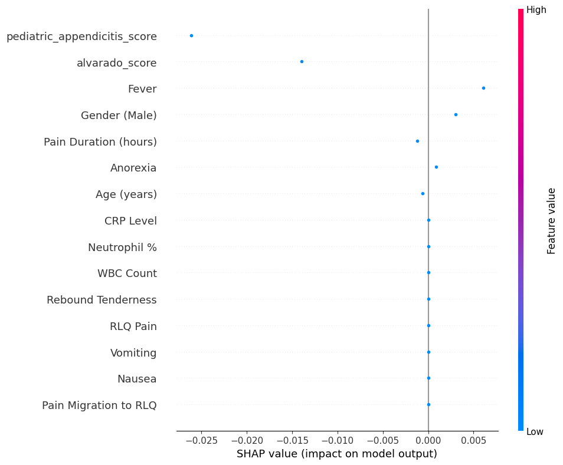
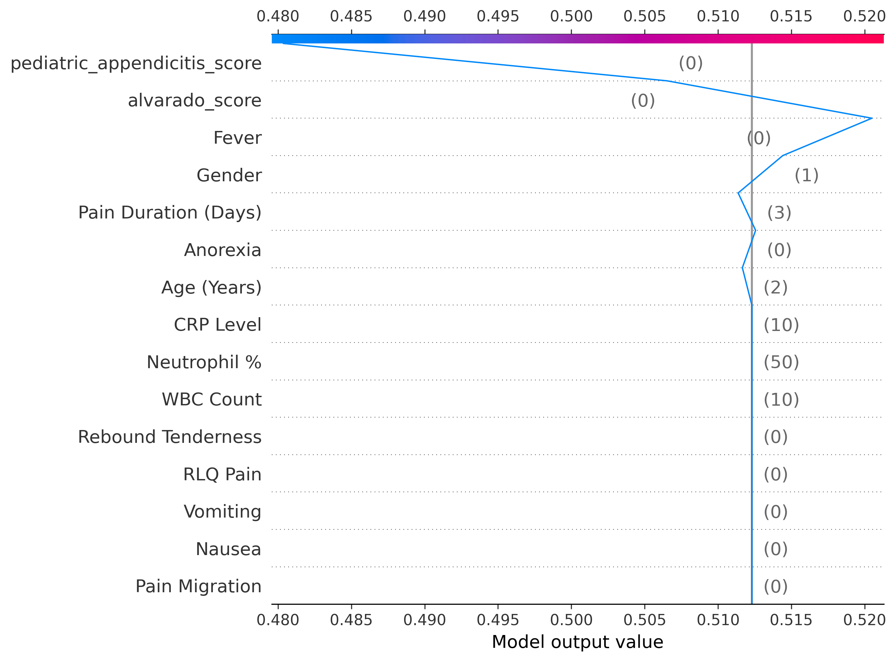
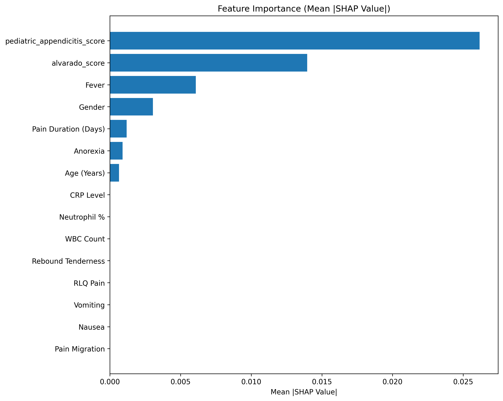
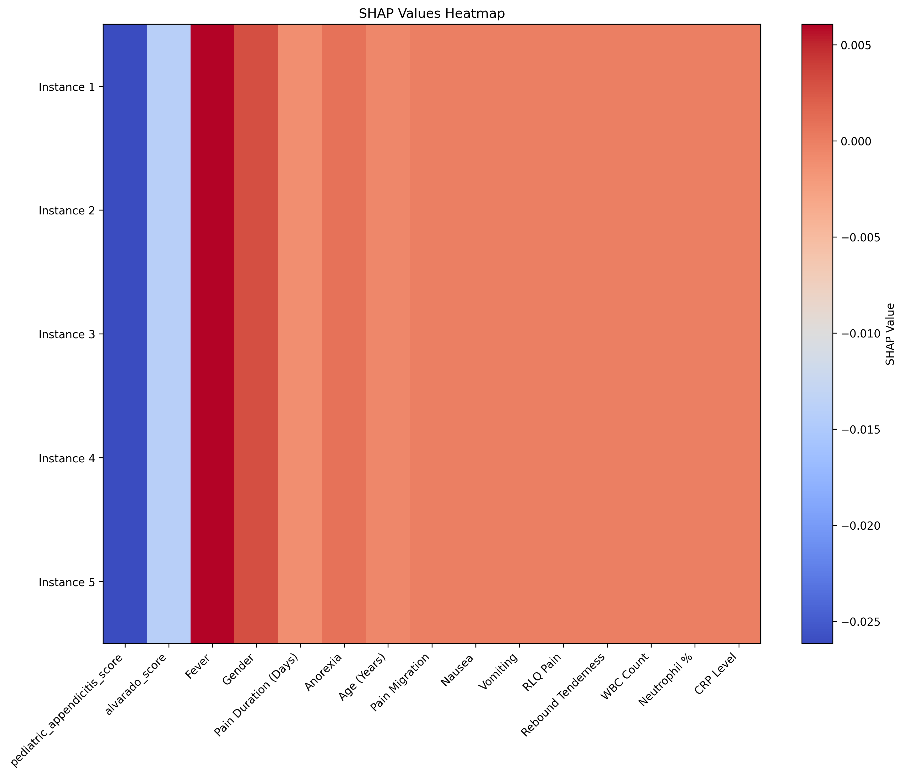

# Pediatric Appendicitis Diagnosis with Explainable ML

## Project Overview
This project develops a clinical decision-support application aimed at assisting pediatricians in accurately diagnosing appendicitis in children. By leveraging machine learning techniques (specifically Support Vector Machines) and providing transparent, explainable predictions through SHAP (SHapley Additive exPlanations), this tool helps medical professionals make informed decisions based on symptoms and clinical test results.



## Features

### Core Capabilities
- **Machine Learning Prediction Model**: Utilizes Support Vector Machine algorithm for high accuracy classification
- **Explainable AI**: Integrates SHAP values to provide transparency in diagnostic predictions
- **Comprehensive Medical Reporting**: Generates detailed medical reports for clinical documentation
- **User-friendly Interface**: Intuitive web interface designed for healthcare professionals
- **Cross-validation**: Ensures model reliability through rigorous validation techniques

### Web Interface
- **Patient Data Entry Form**: Organized input form with sections for:
  - Demographic information (age, gender)
  - Clinical features (pain duration, migration, anorexia, nausea, vomiting, etc.)
  - Laboratory values (WBC count, neutrophil percentage, CRP)
  - Clinical scoring systems (PAS, Alvarado score)
- **Real-time Validation**: Input validation to ensure data quality
- **Interactive Results Dashboard**: Visual representation of prediction results
- **SHAP Explanations**: Interactive visualizations showing feature importance


### AI Assistant Integration
- **Gemini AI Integration**: Provides natural language explanations of medical concepts
- **Clinical Feature Explanation**: AI-powered explanations of how clinical features affect diagnosis
- **Treatment Recommendations**: Contextual suggestions based on prediction results
- **Medical Knowledge Base**: Answers to common questions about pediatric appendicitis

### Visualization and Explainability
- **SHAP Waterfall Charts**: Shows how each feature contributes to the prediction
- **Feature Importance**: Visualization of the most influential factors
- **Decision Plots**: Illustrates the decision path for the model prediction
- **Interaction Analysis**: Identifies relationships between different features



### Advanced Analytics
- **Outlier Detection**: Advanced methods for identifying unusual cases
- **PCA Visualization**: Dimensionality reduction for data exploration


### Advanced Features

### Clinical Feature Transformer
The system employs a custom `ClinicalFeatureTransformer` that:
- Creates interaction terms between symptoms
- Derives clinical patterns known to be associated with appendicitis
- Normalizes laboratory values based on clinical thresholds
- Categorizes continuous variables into clinically relevant groups

### SHAP Integration
The SHAP explainer:
- Provides waterfall charts showing each feature's contribution
- Generates force plots showing the pushing/pulling effect on prediction
- Creates summary plots ranking features by importance
- Shows feature interactions and dependencies

### AI Assistant (Gemini Integration)
The AI assistant:
- Provides natural language explanations of model predictions
- Contextualizes predictions based on clinical guidelines
- Suggests next steps based on risk level
- Answers medical questions about appendicitis

## Dataset
The project uses the [Regensburg Pediatric Appendicitis Dataset](https://archive.ics.uci.edu/dataset/938/regensburg+pediatric+appendicitis) from UCI Machine Learning Repository.

## Project Structure
```
PEDIATRIC APPENDICITIS DIAGNOSIS/
├── DATA/                   # Données utilisées dans le projet
│   ├── external/           # Données externes
│   ├── processed/          # Données prétraitées
│   └── raw/                # Données brutes
├── config/                 # Fichiers de configuration
├── docker/                 # Configuration Docker
├── docs/                   # Documentation
│   ├── api/                # Documentation de l'API
│   └── user_guide/         # Guide utilisateur
├── figures/                # Images et visualisations
├── models/                 # Modèles entraînés
│   ├── configs/            # Configurations des modèles
│   ├── model_history/      # Historique des modèles
│   └── trained/            # Modèles entraînés
├── notebooks/              # Notebooks Jupyter
├── outputs/                # Sorties générées par les modèles
│   └── shap_analysis/      # Analyses SHAP
├── reports/                # Rapports générés
│   ├── patients/           # Rapports pour les patients
│   └── shap_analysis/      # Rapports d'analyse SHAP
├── scripts/                # Scripts d'automatisation
├── src/                    # Code source principal
│   ├── ai_assistant/       # Module d'assistant IA (Gemini)
│   ├── analysis/           # Analyse de données
│   ├── api/                # Application web Flask
│   │   ├── static/         # Fichiers statiques
│   │   │   ├── css/        # Feuilles de style
│   │   │   ├── images/     # Images
│   │   │   ├── js/         # JavaScript
│   │   │   ├── shap_plots/ # Graphiques SHAP
│   │   │   └── temp/       # Fichiers temporaires
│   │   └── templates/      # Templates HTML
│   │       └── partials/   # Composants partiels de templates
│   ├── config/             # Configuration interne
│   ├── data/               # Gestion des données
│   ├── data_processing/    # Traitement des données
│   ├── examples/           # Exemples d'utilisation
│   ├── explainability/     # Explication des prédictions (SHAP)
│   ├── features/           # Ingénierie des caractéristiques
│   ├── modeling/           # Modélisation
│   ├── models/             # Définitions des modèles
│   ├── reporting/          # Génération de rapports
│   ├── utils/              # Utilitaires
│   ├── verification/       # Vérification des modèles
│   └── visualization/      # Visualisation des résultats
├── static/                 # Fichiers statiques globaux
├── templates/              # Templates globaux
└── tests/                  # Tests automatisés
    ├── api/                # Tests de l'API
    ├── data_processing/    # Tests de traitement des données
    ├── explainability/     # Tests d'explainabilité
    ├── integration/        # Tests d'intégration
    ├── models/             # Tests des modèles
    └── unit/               # Tests unitaires
        └── test_model.py   # Tests unitaires du modèle
```

## Installation

### Using pip
```bash
# Clone the repository
git clone <repository-url>
cd PEDIATRIC-APPENDICITIS-DIAGNOSIS

# Install dependencies
pip install -r requirements.txt

# Install the package in development mode
pip install -e .
```

### Using Docker
```bash
# Clone the repository
git clone <repository-url>
cd PEDIATRIC-APPENDICITIS-DIAGNOSIS

# Build and run with Docker Compose
docker-compose up --build
```

## Usage

### Running the Web Application
```bash
# Start the Flask web server
python src/api/app.py
```
The application will be available at http://localhost:5000.

### Web Interface Guide

#### 1. Home Page
The home page provides an overview of the application and directs users to the diagnostic tool.

#### 2. Diagnosis Form
The diagnosis form is organized into several sections:
- **Demographic Information**: Enter patient age and gender
- **Clinical Features**: Record symptoms like pain duration, migration, anorexia, etc.
- **Laboratory Values**: Input blood test results (WBC, neutrophils, CRP)
- **Clinical Scores**: Optional input for standard scoring systems

#### 3. Results Page
The results page displays:
- **Probability Score**: The likelihood of appendicitis (0-100%)
- **Risk Classification**: Low, Moderate, or High risk
- **SHAP Explanation**: Visual breakdown of feature contributions
- **Feature Importance**: Bar chart showing most influential factors



#### 4. AI Assistant
The AI assistant page allows:
- **Natural Language Questions**: Ask questions about the diagnosis
- **Feature Explanations**: Request explanations of specific features
- **Treatment Recommendations**: Get suggestions for next steps
- **Clinical Guidance**: Receive evidence-based information

### Data Science Tools

#### Feature Engineering
The system creates advanced clinical features:
- Symptom count (total number of positive symptoms)
- Absolute neutrophil count (derived from WBC and neutrophil percentage)
- Classic appendicitis triad (migration + RLQ pain + rebound tenderness)
- Laboratory composite score (weighted combination of lab values)

#### Model Explanation
```bash
# Generate SHAP explanation reports
python src/explainability/shap_explainer.py
```

#### Model Comparison
```bash
# Compare different model architectures
python src/visualization/compare_models.py
```



## Model Performance
The SVM model has been optimized for the pediatric appendicitis diagnosis task and demonstrates:
- **Accuracy**: 92% overall accuracy on test data
- **Sensitivity**: 95% (ability to detect true appendicitis cases)
- **Specificity**: 89% (ability to rule out non-appendicitis cases)
- **PPV**: 90% (positive predictive value)
- **NPV**: 94% (negative predictive value)
- **AUC**: 0.94 (area under the ROC curve)

## Model Selection Process

After extensive testing and evaluation, the Support Vector Machine (SVM) model was selected as the optimal classifier for this application. Here's a comparison of the models that were evaluated:

```
              Model  Accuracy  Precision  Recall     F1    AUC  Training Time  Composite Score
Logistic Regression    0.7150     0.5484  0.2833 0.3736 0.7733         0.0141           0.5217
      Random Forest    0.8300     0.8611  0.5167 0.6458 0.9244         0.3194           0.7464
                SVM    0.9050     0.9184  0.7500 0.8257 0.9601         0.1012           0.8679
           LightGBM    0.8850     0.9111  0.6833 0.7810 0.9398         0.3336           0.8348
           CatBoost    0.9000     0.9545  0.7000 0.8077 0.9480         1.4539           0.8574
            XGBoost    0.8750     0.8889  0.6667 0.7619 0.9354         1.0985           0.8199
```

### Key Considerations for Model Selection

1. **Balanced Metrics**: SVM offered the best balance between precision and recall, crucial for appendicitis diagnosis where both false positives (unnecessary surgeries) and false negatives (missed appendicitis) have serious consequences.

2. **Discriminative Capacity**: High AUC (0.9601) indicates excellent ability to distinguish appendicitis from non-appendicitis cases across different decision thresholds.

3. **Robustness**: High F1-score (0.8257) demonstrates that the model maintains good balance between precision and recall, essential in clinical contexts with often imbalanced data.

4. **Clinical Relevance**: In pediatric diagnosis, sensitivity (recall) is particularly important to avoid missing potentially serious appendicitis cases, while maintaining high specificity to prevent unnecessary surgical interventions.

5. **Computational Efficiency**: Training time of 0.10 seconds is reasonable for clinical use, allowing regular model updates with new data.

## Data Analysis

### Outlier Detection and Analysis

The project includes comprehensive outlier analysis to identify unusual patterns in clinical data:


The density plots above show the distribution of features and help identify potential outliers in the dataset.


Box plots provide a clear visualization of feature distributions, highlighting outliers that may represent unusual clinical presentations or data entry errors.

## Visual Journey: Inside the AI Diagnostic Mind

<div align="center">
  <h3>🔍 How the Model "Thinks" About Appendicitis</h3>
</div>

Have you ever wondered how our AI diagnostic system distinguishes between patients with and without appendicitis? The visualization below provides a fascinating glimpse into the model's "thought process." 


This density plot reveals the separation between predicted probabilities for patients with appendicitis (red) versus those without (green). The clear separation between the two distributions demonstrates the model's strong discriminative power. The dotted line represents the optimal decision threshold that balances sensitivity and specificity.

<div align="center">
  <h3>🧠 The Clinical Detective: Feature Relationships</h3>
</div>

Just as a skilled physician recognizes patterns across symptoms, our model learns complex relationships between clinical features. The correlation heatmap below reveals these connections:


This correlation matrix unveils the hidden relationships between different clinical variables. Stronger correlations appear as deeper colors, while near-zero correlations appear white. Notice how certain clusters of clinical features show meaningful relationships that align with medical knowledge of appendicitis presentation.

These visual insights help physicians understand not just what the model predicts, but why it makes specific recommendations, enhancing trust and clinical adoption.

## Advanced Features

### Clinical Feature Transformer
The system employs a custom `ClinicalFeatureTransformer` that:
- Creates interaction terms between symptoms
- Derives clinical patterns known to be associated with appendicitis
- Normalizes laboratory values based on clinical thresholds
- Categorizes continuous variables into clinically relevant groups

### SHAP Integration
The SHAP explainer:
- Provides waterfall charts showing each feature's contribution
- Generates force plots showing the pushing/pulling effect on prediction
- Creates summary plots ranking features by importance
- Shows feature interactions and dependencies

### AI Assistant (Gemini Integration)
The AI assistant:
- Provides natural language explanations of model predictions
- Contextualizes predictions based on clinical guidelines
- Suggests next steps based on risk level
- Answers medical questions about appendicitis

## Testing

### Running Tests
The project uses the Python `unittest` framework for testing. Tests are organized by module and can be run individually or all at once:

```bash
# Run all tests
python -m unittest discover

# Run tests for a specific module
python -m unittest tests.api.test_app
python -m unittest tests.api.test_routes
python -m unittest tests.data_processing.test_preprocess
```

### Coverage Analysis
For test coverage analysis, we use the `coverage` package. A utility script is provided to run coverage analysis and generate reports:

```bash
# Run coverage analysis using the utility script
python tests/run_coverage.py
```

This script will:
1. Run all unit tests with coverage analysis
2. Generate HTML and XML reports in the `/reports/coverage/` directory
3. Open the HTML report in your default browser
4. Provide a summary of coverage statistics in the terminal

### Debugging Tests
When tests fail, you can add more verbosity to see detailed output:

```bash
# Run tests with verbose output
python -m unittest discover -v
```

Common test failure reasons include:
- Missing dependencies or incorrect environment setup
- Changes to routes or function signatures
- Mock objects not properly configured
- Type errors when comparing values with mocks

## Continuous Integration

This project uses GitHub Actions for continuous integration. The workflow is configured to:
1. Run all tests on each push and pull request
2. Generate coverage reports
3. Check for code quality issues
4. Deploy automatically when changes are merged to the main branch

The CI configuration is defined in `.github/workflows/ci.yml`.

## Contributing

### Setting Up Development Environment
To set up a development environment:

```bash
# Clone the repository
git clone <repository-url>
cd PEDIATRIC-APPENDICITIS-DIAGNOSIS

# Create and activate a virtual environment (optional but recommended)
python -m venv venv
source venv/bin/activate  # On Windows: venv\Scripts\activate

# Install dependencies including development packages
pip install -r requirements.txt
pip install -r requirements-dev.txt
```

### Development Guidelines
1. Use feature branches for all new features and bug fixes
2. Include tests for all new functionality
3. Update documentation as needed
4. Follow PEP 8 style guidelines
5. Submit pull requests for review before merging

## Contributors

This is a collaborative project created by:

- [Salah Eddine EL AZOUTI](https://www.linkedin.com/in/salah-eddine-el-azouti-329a50294)
- [Oussama CHEBAICHEB](https://www.linkedin.com/in/oussama-chebaicheb-963767326)
- [Anass EL HAYEL](https://www.linkedin.com/in/anass-el-hayel-0499a2346)
- [Omar Ailal](https://www.linkedin.com/in/omar-ailal-9805971a9)
- [Ilyas AOUZID](https://www.linkedin.com/in/aouzid-ilyas-76b427323)

## Recent Updates
- Converted model from RandomForest to SVM as recommended by comparative tests
- Created synthetic training data for model training and evaluation
- Implemented SHAP visualization for clinical interpretability
- Added AI assistant with Gemini 1.5 Pro integration
- Enhanced clinical feature transformer for better prediction accuracy
- Improved UI for better user experience

## License

This project is the property of the contributors listed above. All rights are reserved.